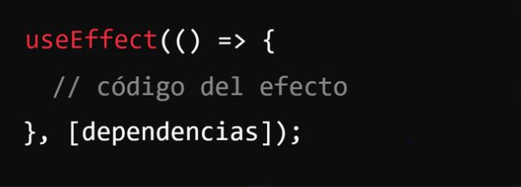
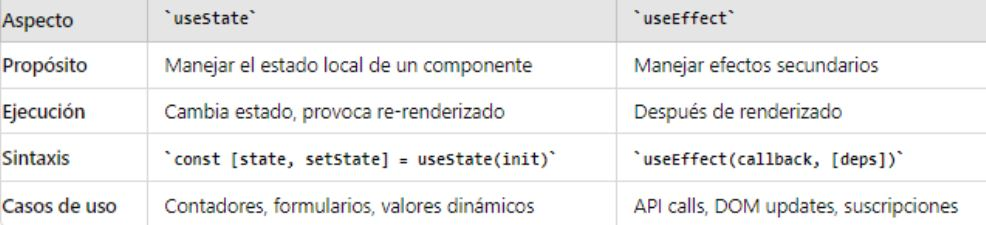

# Píldora Formativa: Hook useEffect de React

## Introducción

Los hooks son una característica introducida en
React que permite usar el estado y otras
funcionalidades de React entre componentes
funcionales sin necesidad de escribir clases.
Antes de los hooks la gestión del estado y el ciclo de
vida de los componentes solo estaba disponible en los
componentes de clase, lo que hacía el código más
complejo y menos reutilizable.

## Presentación en Canva

Puedes acceder a la presentación sobre useEffect en Canva en el siguiente enlace: [Enlace a la presentación en Canva](https://www.canva.com/design/DAGPaJ_xqQM/jthw_x_IIqFcM0R8IYAqsw/edit?utm_content=DAGPaJ_xqQM&utm_campaign=designshare&utm_medium=link2&utm_source=sharebutton).


## Contenido de la píldora

- Introducción
- ¿Qué es useEffect?
- Sintaxis
- Comparación con useState
- Conclusión
- Ejercicio práctico

## Introducción

Los hooks son una característica introducida en
React que permite usar el estado y otras
funcionalidades de React entre componentes
funcionales sin necesidad de escribir clases.
Antes de los hooks la gestión del estado y el ciclo de
vida de los componentes solo estaba disponible en los
componentes de clase, lo que hacía el código más
complejo y menos reutilizable.

## ¿Qué es useEffect?

En React, useEffect es un Hook que te permite realizar efectos secundarios en tus componentes funcionales.
Los efectos secundarios son acciones que van más allá de la simple renderización de un componente, como:

- Fetch de datos: Traer información de APIs para actualizar tu interfaz.
- Suscripciones: Escuchar eventos y reaccionar en consecuencia.
- Manipulación del DOM: Interactuar con el DOM de forma controlada.
- Limpieza: Asegurarte de que tus componentes se limpian correctamente al desmontarse.

## Sintaxis



## Diferencias con useState



## Conclusión

useEffect es una herramienta poderosa que, combinada con otros hooks como useState, proporciona una forma eficiente y moderna de gestionar la lógica de los componentes en aplicaciones React, promoviendo código más limpio, modular y fácil de mantener.

Es esencial para manejar efectos secundarios en componentes funcionales.


## Ejercicio práctico

Explicación: vamos a crear un componente de React llamado CuentaRegresiva.
Este componente va a mostrar un contador de vidas que disminuirá cada vez que se haga clic en un GIF.
A medida que las vidas disminuyan se irá mostrando un mensaje en pantalla anunciando las vidas restantes
y cuando el contador de vidas llegue a 0 se mostrará un mensaje de 'GAME OVER'.


Pasos a seguir para realizar el ejercicio práctico:

**1. Entorno de desarrollo:**

Asegúrate de tener Node.js y npm instalados en tu sistema. Si no los tienes
puedes descargarlos desde nodejs.org. La instalación de Node.js incluye npm (Node Package Manager).

**2. Crea un nuevo Proyecto React:**
- Abre la terminal en Visual Studio Code
- Navega a la carpeta deseada para ubicar el proyecto
- Ejecuta el siguiente comando para crear una carpeta llamada 'pildora-useeffect' con la estructura básica de proyecto React

```bash
npm create vite@latest pildora-useEffect
Selecciona React
Selecciona JavaScript

```
- Navega al directorio del proyecto 

```bash
cd pildora-useEffect
```
- Instala las dependencias

```bash
npm install
```

- Asegúrate de estar estar en el directorio del proyecto (en este caso 'pildora-useeffect') e inicia el terminal de desarrollo con el siguiente comando en la terminal:

```bash
npm run dev
```
la aplicación debería abrirse automáticamente en tu navegador predeterminado en 'http://localhost:5173'. Si no es así, abre esta URL manualmente.


**3. Crea el archivo del componente:**

En la carpeta 'src', crea una carpeta que se llame 'components' y dentro un archivo llamado 'CuentaRegresiva'.jsx y copia y pega en él el siguiente código:

```bash
import React, { useState, useEffect } from 'react';
import './CuentaRegresiva.css'; // Importa el archivo CSS

function CuentaRegresiva() {
  const [vidas, setVidas] = useState(3);
  const [gameOver, setGameOver] = useState(false);
  const [mensajeVidas, setMensajeVidas] = useState('');

  useEffect(() => {
    if (vidas === 0) {
      setGameOver(true);
    } else {
      setMensajeVidas(`Te quedan ${vidas} vidas`);
    }
  }, [vidas]);

  const handleDecremento = () => {
    if (vidas > 0) {
      setVidas(vidas - 1);
    }
  };

  return (
    <div className="cuenta-regresiva-container">
      <h1>Cuenta Regresiva</h1>
      {!gameOver ? (
        <div>
          <p>{vidas}</p>
          
          <p className="cuenta-regresiva-message">{mensajeVidas}</p>
        </div>
      ) : (
        <h2 className="cuenta-regresiva-game-over">Game Over</h2>
      )}
    </div>
  );
}

export default CuentaRegresiva;
```

**4. Crea el archivo CSS:**

En la misma carpeta de 'components' puedes crear un archivo llamado CuentaRegresiva.css y en él copias y pegas el siguiente código:

```bash
/* CuentaRegresiva.css */
.cuenta-regresiva-container {
    text-align: center;
    margin-top: 50px;
  }
  
  .cuenta-regresiva-image {
    width: 500px;
    height: 320px;
    cursor: pointer;
  }
  
  .cuenta-regresiva-message {
    font-size: 1.2em;
  }
  
  .cuenta-regresiva-game-over {
    font-size: 2em;
    color: red;
  }

  .cuenta-regresiva-message{

    font-size: 30px;
    font-weight: bold;
    color: rgb(184, 12, 12);
  }
  .cuenta-regresiva-game-over{
    font-size: 120px;
  }
```

**5. Integra el componente en la aplicación:**

Para ello abre el archivo 'App.js', en 'src/App.js' e incluye el nuevo componente, el código debe quedar así:

```bash
import React from 'react';
import './App.css';
import CuentaRegresiva from './components/CuentaRegresiva';

function App() {
  return (
    <div className="App">
      <CuentaRegresiva />
    </div>
  );
}

export default App;
```


**7. Verifica el resultado:**

Deberías ver el componente CuentaRegresiva que muestra un contador de vidas y un GIF.
Al hacer clic en el GIF, el contador debería decrementar y mostrar un mensaje con las vidas restantes.
Cuando las vidas lleguen a cero, se debería mostrar el mensaje de "Game Over".


#

**¡Gracias!**